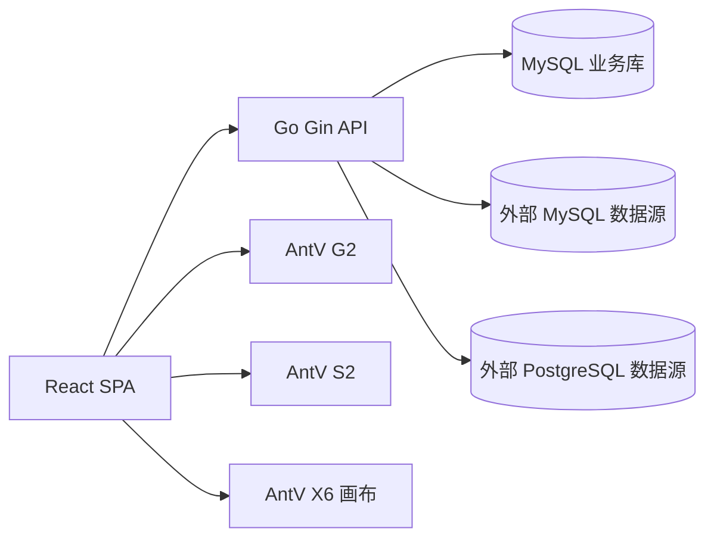

# LightBI 当前项目分析报告

生成时间：2026-05-22  
代码版本：`ff3fffe`  
分析范围：前端、后端、数据库模型、核心业务流程、风险与优化建议

## 1. 总览

当前项目已经不是单一的 BI 图表创建器，而是一个轻量级 BI 仪表盘资产管理系统。它覆盖了登录鉴权、工作空间/项目权限、图表资产列表、分组标签、数据源、数据集、仪表盘设计器、发布分享、导出订阅、版本记录和审计等能力。

整体架构是典型的前后端分离：

- 前端：React SPA，负责登录、资产列表、仪表盘编辑器、公开访问页和管理页面。
- 后端：Go Gin API 服务，负责认证、权限、图表配置 CRUD、数据集查询、版本审计、分享发布等。
- 数据库：MySQL 作为业务库，图表配置和数据集查询配置以 JSON 字段保存。
- 外部数据：支持 MySQL 和 PostgreSQL 数据源，后端负责字段解析、查询校验、预览和缓存。

目前项目的基础骨架完整，功能覆盖面较广，但也因此出现了几个明显风险：编辑器复杂度上升、图表配置模型演进压力、前端包体偏大、数据库迁移缺少版本化、数据源查询安全需要进一步加强。

## 2. 技术栈

### 2.1 前端

主要依赖来自 `frontend/package.json`：

| 分类 | 技术 |
| --- | --- |
| UI 框架 | React 19、React DOM |
| 路由 | React Router DOM 7 |
| 状态管理 | Zustand 5 |
| 构建工具 | Webpack 5、webpack-dev-server、ts-loader、fork-ts-checker-webpack-plugin |
| 语言 | TypeScript 5.7，开启 strict |
| UI 组件 | Ant Design 5 |
| 图表/可视化 | AntV G2、AntV S2、AntV X6 |
| 时间处理 | dayjs、moment |
| 安全/导出 | DOMPurify、html-to-image |
| 测试 | Playwright |

前端核心特点：

- 使用 `React.lazy` 做页面级懒加载。
- Access Token 保存在内存中，Refresh Token 依赖 HttpOnly Cookie。
- API 请求统一经过 `src/api/client.ts`，401 后自动调用 refresh 再重试。
- 仪表盘编辑器状态集中在 `designerStore` 中管理。
- 图表渲染主要由 `ChartRenderer` 承担，表格类图表使用 S2，常规图表使用 G2。

### 2.2 后端

主要依赖来自 `backend/go.mod`：

| 分类 | 技术 |
| --- | --- |
| 语言 | Go 1.22 |
| Web 框架 | Gin |
| ORM | GORM |
| 业务数据库 | MySQL Driver |
| 外部数据源 | MySQL、PostgreSQL pgx |
| 认证 | JWT v5、bcrypt |
| 配置 | godotenv |
| JSON 字段 | GORM datatypes.JSON |
| 测试 | Go test，部分测试使用 SQLite driver |

后端核心特点：

- `cmd/server/main.go` 负责加载配置、校验生产环境、连接数据库、自动迁移、种子数据和启动服务。
- 路由集中在 `internal/router/router.go`。
- 认证采用 Access Token + Refresh Token。
- 权限分为系统角色和工作空间/项目成员权限。
- 图表、数据集、数据源、发布分享等业务逻辑主要在 handlers 和 services 中。

### 2.3 数据库

业务库使用 MySQL。核心表模型在 `backend/internal/models/models.go` 中定义，主要包括：

- 用户认证：`users`、`refresh_tokens`
- 空间权限：`workspaces`、`workspace_members`、`projects`、`project_members`
- 图表资产：`charts`、`chart_groups`、`chart_tags`、`chart_tag_relations`
- 版本审计：`chart_versions`、`audit_logs`
- 发布分享：`dashboard_share_links`、`dashboard_subscriptions`
- 数据能力：`data_sources`、`datasets`、`dataset_query_caches`

图表配置、数据源参数、数据集字段、查询缓存等使用 JSON 字段保存，适合首版快速迭代，但后续需要关注 schema 演进。

## 3. 目录结构

### 3.1 根目录

```text
.
├── README.md
├── PROJECT_EVALUATION_REPORT.md
├── backend
└── frontend
```

说明：

- `README.md`：项目说明、功能范围、启动方式。
- `PROJECT_EVALUATION_REPORT.md`：当前存在的未跟踪评估文件，本报告未覆盖它。
- `backend/`：Go API 服务。
- `frontend/`：React 前端应用。

### 3.2 前端目录

```text
frontend/src
├── App.tsx
├── main.tsx
├── api
│   └── client.ts
├── components
│   └── RequireAuth.tsx
├── features
│   └── charts
│       ├── ChartConfigPanel.tsx
│       ├── ChartRenderer.tsx
│       ├── DashboardFilterBar.tsx
│       ├── DashboardGovernancePanel.tsx
│       ├── DashboardView.tsx
│       ├── DesignerCanvas.tsx
│       └── chartUtils.ts
├── layouts
│   └── AppShell.tsx
├── pages
│   ├── ChartEditorPage.tsx
│   ├── ChartsPage.tsx
│   ├── DataSourcesPage.tsx
│   ├── DatasetsPage.tsx
│   ├── LoginPage.tsx
│   ├── PublicDashboardPage.tsx
│   ├── PublishedDashboardPage.tsx
│   └── WorkspacesPage.tsx
├── store
│   ├── authStore.ts
│   ├── designerStore.ts
│   ├── editorToolbarStore.ts
│   └── workspaceStore.ts
├── styles
│   └── global.css
└── types
    └── domain.ts
```

重点模块：

- `api/client.ts`：统一 API 客户端、Token 刷新、接口类型。
- `store/authStore.ts`：登录态、用户信息、登出。
- `store/designerStore.ts`：仪表盘编辑器的核心状态，包括组件、筛选、运行时数据、布局。
- `pages/ChartsPage.tsx`：资产列表、分组、标签、高级筛选。
- `pages/ChartEditorPage.tsx`：仪表盘创建/编辑入口。
- `features/charts/DesignerCanvas.tsx`：预览区、拖拽、缩放、选中、删除。
- `features/charts/ChartConfigPanel.tsx`：右侧数据/样式/联动配置。
- `features/charts/ChartRenderer.tsx`：图表实际渲染。
- `features/charts/DashboardFilterBar.tsx`：仪表盘筛选控件。

### 3.3 后端目录

```text
backend
├── cmd
│   └── server
│       └── main.go
└── internal
    ├── config
    ├── database
    ├── handlers
    ├── middleware
    ├── models
    ├── router
    └── services
```

重点模块：

- `cmd/server/main.go`：服务启动入口。
- `internal/config`：环境变量配置与生产环境安全校验。
- `internal/database`：数据库连接、自动迁移、种子数据。
- `internal/router`：API 路由注册。
- `internal/middleware`：认证、角色、工作空间/项目权限。
- `internal/handlers`：HTTP 业务接口。
- `internal/services`：认证、数据集查询、数据源连接、订阅调度等业务服务。
- `internal/models`：GORM 数据模型。

## 4. 系统架构



整体数据流：

1. 用户通过前端登录，后端返回 Access Token，并写入 Refresh Token Cookie。
2. 前端进入受保护路由时调用 `/api/auth/me` 校验登录态。
3. 用户在图表列表页筛选、分组、查看、复制、发布或归档图表资产。
4. 用户进入编辑器后，通过左侧图表类型创建组件，在中间画布拖拽/缩放，在右侧配置数据、样式和联动。
5. 前端根据数据源和数据集配置调用后端查询接口获取预览数据。
6. 后端校验权限、字段、过滤条件和 SQL 安全后查询业务库或外部数据源。
7. 前端使用 G2/S2 渲染图表，将布局和配置保存到 `charts.config`。
8. 发布后生成版本记录、审计记录，并支持公开分享、嵌入、导出和订阅。

## 5. 核心业务流程

### 5.1 登录与权限流程

入口文件：

- 前端：`frontend/src/pages/LoginPage.tsx`
- 前端守卫：`frontend/src/components/RequireAuth.tsx`
- API 客户端：`frontend/src/api/client.ts`
- 后端认证：`backend/internal/handlers/auth_handler.go`
- 后端中间件：`backend/internal/middleware`

流程：

1. 用户登录或注册。
2. 后端校验账号密码，密码使用 bcrypt 哈希。
3. 后端返回 Access Token，同时通过 HttpOnly Cookie 设置 Refresh Token。
4. 前端把 Access Token 保存在内存变量中，不写入 localStorage。
5. 请求接口时携带 `Authorization: Bearer <token>`。
6. Access Token 过期时，前端自动调用 `/api/auth/refresh` 获取新 token 并重试原请求。
7. 未登录访问受保护路由时跳转 `/login`。

权限层级：

- 系统角色：`admin`、`editor`、`viewer`
- 工作空间成员角色
- 项目成员角色

这种设计比单一 RBAC 更适合多项目 BI 平台，但也要求每个业务接口都严格校验 workspace/project scope。

### 5.2 图表资产列表流程

入口文件：

- `frontend/src/pages/ChartsPage.tsx`
- `backend/internal/handlers/chart_handler.go`

能力：

- 图表列表查询
- 分组树
- 标签管理
- 高级筛选
- 新建、编辑、复制、发布、归档、删除
- 工作空间/项目上下文切换

列表筛选大致包括：

- 关键字
- 图表类型
- 状态
- 分组
- 标签
- 创建人
- 时间范围
- 分页排序

后端查询时会结合项目权限过滤，避免跨项目读取数据。

### 5.3 仪表盘编辑流程

入口文件：

- `frontend/src/pages/ChartEditorPage.tsx`
- `frontend/src/store/designerStore.ts`
- `frontend/src/features/charts/DesignerCanvas.tsx`
- `frontend/src/features/charts/ChartConfigPanel.tsx`
- `frontend/src/features/charts/ChartRenderer.tsx`

流程：

1. 新建仪表盘时初始化一个空配置。
2. 编辑已有仪表盘时调用 `/api/charts/:id` 拉取配置。
3. 用户从左侧图表类型区域添加组件。
4. `designerStore.addWidget` 创建组件并寻找不重叠的位置。
5. 用户在画布中选中、拖拽、缩放组件。
6. 用户在右侧配置区配置数据、样式、联动。
7. 点击更新后按当前组件的数据源、数据集、维度、指标调用后端查询数据。
8. `ChartRenderer` 根据组件类型渲染图表。
9. 保存时 `designerStore.toPayload` 输出完整 dashboard config，提交给后端。

设计器配置当前以 `version: 2` 的 JSON schema 保存，核心字段包括：

- `dashboard`
- `widgets`
- `filters`
- `canvas`

其中 widget 配置包含：

- 图表类型
- 布局位置和尺寸
- 标题
- 维度和指标
- 数据查询参数
- 显示标签、tooltip、scrollbar
- 主题、标签大小
- 联动配置
- 文本组件内容

### 5.4 数据源与数据集流程

入口文件：

- 前端页面：`DataSourcesPage.tsx`、`DatasetsPage.tsx`
- 后端处理器：`data_source_handler.go`、`dataset_handler.go`
- 后端服务：`dataset_query.go`、`data_source_connector.go`

能力：

- 数据源 CRUD 和连接测试
- 数据集 CRUD
- 数据集字段获取
- 数据集预览
- 数据集查询
- 查询缓存
- SQL 数据集只读校验

查询流程：

1. 前端选择数据源类型和数据集。
2. 后端返回数据集字段，字段包含维度和指标。
3. 用户选择维度、指标。
4. 前端提交 query 请求。
5. 后端校验字段、过滤条件、排序、聚合和 limit。
6. 如果是 SQL 数据集，会做只读 SQL 规范化和字段映射。
7. 后端查询外部数据源或 mock/标准数据集。
8. 返回 rows 给前端渲染。

当前实现已经有基本的 SQL 安全防护，但生产环境仍建议配合数据库只读账号、超时、白名单和审计。

### 5.5 图表渲染流程

入口文件：

- `frontend/src/features/charts/ChartRenderer.tsx`
- `frontend/src/features/charts/chartUtils.ts`

渲染策略：

- 明细表、交叉表、对比表：使用 S2 或表格类渲染。
- 折线图、柱状图、条形图、饼图、环图、堆叠图：使用 G2。
- 指标看板、指标趋势卡、富文本：使用自定义 React 渲染。
- 富文本使用 DOMPurify 处理，降低 XSS 风险。

空数据状态：

- 新增图表默认显示灰色示意图。
- 用户配置数据并点击更新后，渲染真实数据。

### 5.6 筛选与联动流程

入口文件：

- `frontend/src/features/charts/DashboardFilterBar.tsx`
- `frontend/src/store/designerStore.ts`
- `frontend/src/features/charts/ChartRenderer.tsx`

当前筛选控件是动态添加组件，不再默认占位。主要能力：

- 日期筛选
- 维度控件
- 维度控件可自定义名称
- 维度控件可关联当前仪表盘下的多个图表
- 枚举值来自被关联图表的维度枚举
- 删除维度控件

运行时筛选值会传入图表渲染逻辑，对图表数据进行过滤。

### 5.7 发布、分享、审计流程

入口文件：

- `DashboardGovernancePanel.tsx`
- `PublishedDashboardPage.tsx`
- `PublicDashboardPage.tsx`
- 后端 chart、share、subscription 相关 handlers

能力：

- 发布仪表盘
- 保存并发布
- 版本记录
- 回滚
- 审计日志
- 分享链接
- 嵌入链接
- 导出
- 订阅任务

这部分已经具备 BI 资产管理系统的雏形，但后续需要完善真实通知渠道、权限水印、导出任务队列和访问统计。

## 6. 主要风险

### P0/P1：需要优先处理

#### 6.1 Refresh Token 轮换需要事务化

当前认证设计已经避免把 Access Token 持久化到浏览器，这是好的方向。但 Refresh Token 轮换流程需要确保“校验、吊销旧 token、签发新 token”在数据库层面具备原子性。

风险：

- 并发 refresh 可能造成重复签发。
- 旧 token 吊销和新 token 创建之间如果失败，用户会被迫重新登录。
- 安全审计上难以证明 refresh token 单次使用。

建议：

- 使用数据库事务包裹 refresh 流程。
- 对旧 token 做条件更新：只允许 `revoked_at IS NULL` 的记录被吊销。
- 根据受影响行数判断 token 是否已被使用。
- 为 jti/hash 增加唯一约束。

#### 6.2 数据库迁移依赖 AutoMigrate

当前启动流程中存在自动迁移能力，适合开发阶段，但不适合作为长期生产迁移方案。

风险：

- 无法清晰追踪每次 schema 变更。
- 回滚困难。
- 多环境之间 schema 漂移不易发现。
- 删除字段、复杂索引、数据修复脚本难以管理。

建议：

- 引入 `goose` 或 `golang-migrate`。
- 建立 `migrations/` 目录。
- CI 中增加迁移验证。
- 生产环境禁用自动结构变更。

#### 6.3 外部 SQL 数据源安全边界需要加强

后端已经做了只读 SQL 规范化和查询字段校验，这是必要但不充分的。

风险：

- SQL 解析规则可能存在绕过。
- 外部数据库账号权限过大时，应用层保护失效会造成越权读取。
- 大查询可能拖垮外部数据源。

建议：

- 强制使用只读账号。
- 数据源级别配置 query timeout、max rows、max bytes。
- 禁止多语句、DDL、DML、系统表访问。
- 增加查询审计和慢查询日志。
- 对外部数据源连接池做隔离和限流。

### P2：中短期需要优化

#### 6.4 前端包体偏大

`npm run build` 已通过，但 Webpack 输出存在体积告警。明显的大资源包括登录背景图和多个超过推荐大小的 chunk。

风险：

- 首屏加载慢。
- 弱网下登录页和编辑器体验差。
- AntV、AntD、图表渲染逻辑会进一步推高包体。

建议：

- 对 G2、S2、X6 做更细粒度动态 import。
- 将编辑器相关模块从资产列表页完全拆分。
- 优化登录背景图尺寸和格式。
- 启用 bundle analyzer 做持续监控。

#### 6.5 编辑器状态和渲染逻辑耦合偏高

当前 `designerStore`、`ChartConfigPanel`、`DesignerCanvas`、`ChartRenderer` 之间耦合较强。

风险：

- 新增图表类型时容易影响已有图表。
- 图表 schema 演进缺少迁移层。
- 样式、数据、联动配置容易出现“保存了但渲染不生效”的情况。

建议：

- 引入 chart registry，把图表类型、默认配置、字段约束、渲染器拆开注册。
- 为 dashboard config 建立 schema migration。
- 将运行时数据和持久化配置严格分离。

#### 6.6 测试覆盖不足

当前已有 Go test、TypeScript typecheck、Webpack build 和一条 Playwright E2E。基础验证有效，但覆盖不足。

缺口：

- 编辑器拖拽、缩放、删除、保存后重载。
- 图表数据源独立性。
- 筛选控件关联图表枚举值。
- 版本回滚后的配置一致性。
- 权限场景下 viewer/editor/admin 的差异。
- 真实 MySQL 环境下的数据迁移和查询。
- 图表视觉回归。

建议：

- 增加编辑器核心链路 E2E。
- 增加后端 handler 权限测试。
- 增加数据集查询服务的边界测试。
- 增加 Playwright screenshot 视觉回归。

#### 6.7 图表配置 JSON 后续演进压力较大

JSON 字段适合快速开发，但随着图表类型、筛选、联动、主题、数据集配置持续增加，schema 会越来越复杂。

风险：

- 旧配置无法兼容新渲染器。
- 缺少配置校验，坏数据会在前端运行时报错。
- 难以做跨版本回滚和批量修复。

建议：

- 明确定义 dashboard config schema。
- 保存前后端都做 schema validation。
- 增加 `version` 到 migration 映射。
- 为每个图表类型定义最小必需字段。

#### 6.8 发布、导出、订阅能力还偏同步和应用内

当前已经有发布、分享、导出、订阅接口，但从产品化角度还需要补齐异步任务与通知能力。

风险：

- 导出大仪表盘时请求超时。
- 订阅任务缺少稳定投递渠道。
- 缺少失败重试和任务状态。

建议：

- 引入后台任务队列。
- 导出任务异步化。
- 订阅支持邮件/企微/飞书等真实通知渠道。
- 增加任务执行日志和失败重试。

## 7. 可以优化的地方

### 7.1 短期优化

1. 将 Refresh Token 轮换改为事务化。
2. 为编辑器增加核心 E2E：添加图表、配置数据、更新渲染、拖拽缩放、保存、重新进入。
3. 对登录背景图和 AntV 相关模块做包体优化。
4. 增加 dashboard config schema 校验。
5. 增强数据集查询错误展示，避免用户只看到通用失败提示。
6. 为 ChartRenderer 增加异常边界，单个图表失败不影响整个仪表盘。
7. 增加真实后端联调 E2E，而不是只依赖 mock API。

### 7.2 中期优化

1. 引入版本化数据库迁移。
2. 抽象图表注册机制，降低新增图表类型成本。
3. 数据源连接增加超时、限流、只读账号校验和审计。
4. 对工作空间/项目权限增加系统性测试矩阵。
5. 将导出、订阅改成异步任务。
6. 增加仪表盘视觉回归测试。
7. 增加性能指标采集，包括首屏、编辑器交互延迟、图表渲染耗时、数据查询耗时。

### 7.3 长期优化

1. 建立数据集语义层，支持计算字段、字段别名、维度层级、指标口径。
2. 支持行级权限和列级权限。
3. 支持仪表盘协同编辑、评论、变更 diff。
4. 支持多租户隔离和租户级配额。
5. 建立完整可观测体系：日志、指标、链路追踪、审计。
6. 对图表渲染引擎做插件化，支持更多图表库或自定义组件。

## 8. 验证结果

本次分析过程中执行了以下验证：

```bash
GOCACHE=/private/tmp/lightbi-go-cache go test ./...
npm run typecheck
npm run build
npm run e2e
```

结果：

- 后端测试通过。
- 前端 TypeScript 类型检查通过。
- 前端生产构建通过。
- Playwright E2E 通过，当前为 1 条用例。
- 构建存在资源体积告警，需要作为性能优化项处理。

## 9. 推荐下一步优先级

| 优先级 | 事项 | 原因 |
| --- | --- | --- |
| P1 | Refresh Token 轮换事务化 | 认证安全基础能力，影响登录稳定性和安全审计 |
| P1 | 引入版本化数据库迁移 | 生产环境必须具备可追踪、可回滚的 schema 变更 |
| P1 | 编辑器核心 E2E 补齐 | 当前最核心业务链路，需要防止 UI 快速迭代产生回归 |
| P2 | 图表配置 schema validation/migration | 降低旧配置兼容风险 |
| P2 | 前端 bundle 拆分和图片优化 | 当前构建已有体积告警，后续功能增加会持续恶化 |
| P2 | 数据源查询安全增强 | 外部数据库访问属于高风险边界 |
| P3 | 图表 registry 插件化 | 降低后续新增图表类型和样式能力的维护成本 |

## 10. 结论

LightBI 当前已经具备 BI 资产管理系统的核心骨架：权限、资产、数据源、数据集、仪表盘编辑、发布分享和审计都有实现入口。项目技术选型合理，前后端职责清晰，适合作为首版产品继续推进。

但从工程成熟度看，当前更接近“功能覆盖完整的首版系统”，还不是“可长期稳定演进的生产级 BI 平台”。下一阶段建议重点处理认证事务、数据库迁移、查询安全、编辑器测试和图表配置 schema 演进。这些问题优先级高，因为它们直接影响安全性、可维护性和后续功能扩展成本。
