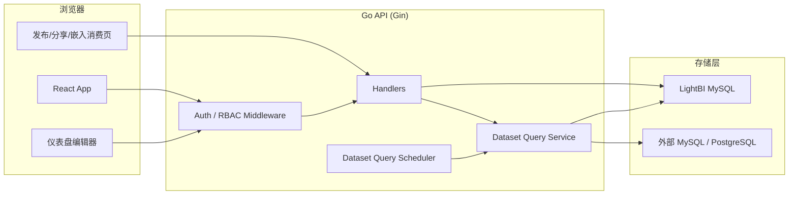
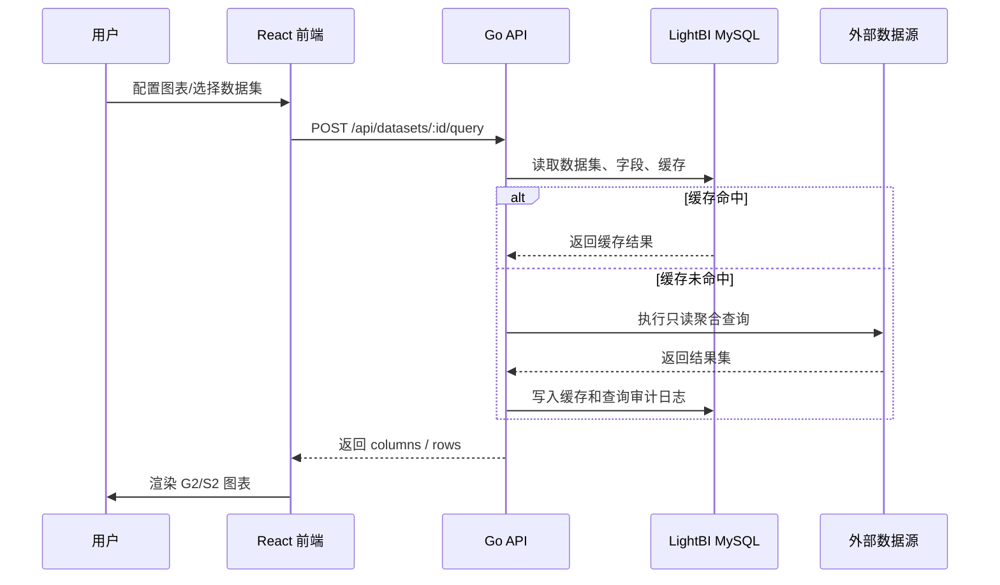

# LightBI

LightBI 是一个 BI 图表资产管理与轻量仪表盘编辑系统。项目包含 React 前端和 Go 后端，覆盖登录鉴权、工作空间/项目权限、数据源、数据集查询、图表资产管理、仪表盘编辑、发布分享、版本审计和基础订阅等能力。

当前定位更接近可演示、可继续扩展的 BI MVP 骨架，不是开箱即用的企业级生产 BI 平台。

## 主要功能

### 账号与权限

- 登录、注册、登出、Access Token + Refresh Token。
- 系统角色：`admin`、`editor`、`viewer`。
- 工作空间和项目成员角色，用于对象级权限隔离。
- 生产环境会拒绝默认 JWT secret、默认 MySQL DSN、默认 seed 密码、默认数据源加密密钥和自动 seed。

### 图表资产与治理

- 图表资产列表，支持表格/卡片视图。
- 多级分组目录、标签、状态、创建人、更新时间、关键字等筛选。
- 图表配置 CRUD，配置以 `ChartDocument` JSON 形式落库。
- 发布版本快照、版本查看、版本回滚、审计日志。
- 分享链接、公开访问、嵌入访问、CSV/PNG 导出、应用内订阅记录。

### 仪表盘编辑器

- 左侧图表类型选择，中间画布，右侧配置面板。
- 支持表格、透视表、对比表、指标卡、趋势指标卡、柱状图、条形图、堆叠图、百分比堆叠图、折线图、饼图、环图、文本和富文本组件。
- 图表类型、默认尺寸、分组和渲染器由统一 registry 管理。
- 图表渲染使用 AntV G2/S2，画布底层使用 X6。
- 单个组件渲染失败时有错误边界，不会拖垮整个画布。
- 记录基础前端性能指标：FCP、LCP、CLS、INP、编辑交互耗时和图表渲染耗时。

### 数据源与数据集

- 支持 MySQL / PostgreSQL 外部数据源管理和连接测试。
- 数据源密码使用服务端加密保存。
- 支持标准数据集、直连数据集、SQL 数据集。
- 数据集查询支持字段校验、聚合、过滤、排序、Top N、limit、查询超时、查询缓存和手动刷新。
- SQL 数据集会做只读 SQL 校验，查询使用参数绑定，并记录查询审计日志。
- 数据集查询有并发闸门和审计日志保留期配置。

## 技术栈

| 层 | 技术 |
|---|---|
| 前端 | React 19、TypeScript、Webpack、Ant Design、AntV G2/S2/X6、Zustand、React Router |
| 后端 | Go 1.22、Gin、GORM、MySQL、JWT、AES-GCM |
| 数据源 | MySQL、PostgreSQL |
| 测试 | Go test、TypeScript typecheck、Webpack build、Playwright e2e |

## 架构图



## 核心数据流



## 目录结构

```text
lightbi-codex/
├── backend/
│   ├── cmd/server/                 # 后端入口，加载配置、连接数据库、启动 Gin
│   ├── internal/config/            # 环境变量、配置校验
│   ├── internal/database/          # MySQL 连接、AutoMigrate、版本化迁移、seed
│   ├── internal/handlers/          # REST API handlers 和 DTO
│   ├── internal/middleware/        # JWT 鉴权、角色权限中间件
│   ├── internal/models/            # GORM 模型和枚举
│   ├── internal/router/            # API 路由注册
│   └── internal/services/          # JWT、密码、数据源、数据集查询、调度、安全净化
├── frontend/
│   ├── e2e/                        # Playwright 端到端测试
│   ├── src/api/                    # API client
│   ├── src/components/             # 通用组件
│   ├── src/features/auth/          # 登录相关能力
│   ├── src/features/charts/        # 图表编辑、渲染、治理面板、工具函数
│   ├── src/layouts/                # 应用布局
│   ├── src/pages/                  # 页面入口
│   ├── src/store/                  # Zustand 状态
│   ├── src/styles/                 # 全局样式
│   └── src/types/                  # 前端领域类型
├── LIGHTBI_PROJECT_ANALYSIS.md     # 项目分析文档
└── README.md
```

## 本地启动

### 1. 准备 MySQL

```sql
CREATE DATABASE lightbi DEFAULT CHARACTER SET utf8mb4 COLLATE utf8mb4_unicode_ci;
CREATE USER '<db_user>'@'%' IDENTIFIED BY '<db_password>';
GRANT ALL PRIVILEGES ON lightbi.* TO '<db_user>'@'%';
FLUSH PRIVILEGES;
```

### 2. 启动后端

```bash
cd backend
cp .env.example .env
go mod download
go run ./cmd/server
```

默认监听：`http://127.0.0.1:8080`。

本地首次启动建议在 `backend/.env` 中开启迁移和 seed：

```env
APP_ENV=development
APP_ADDR=:8080
MYSQL_DSN=<db_user>:<db_password>@tcp(127.0.0.1:3306)/lightbi?charset=utf8mb4&parseTime=True&loc=Local
JWT_ACCESS_SECRET=<set-a-long-random-access-secret>
JWT_REFRESH_SECRET=<set-a-long-random-refresh-secret>
RUN_AUTO_MIGRATE=true
RUN_SEED_DEFAULTS=true
SEED_ADMIN_PASSWORD=<set-a-local-admin-password>
REGISTER_MODE=invite
REGISTER_CODE=<set-a-register-code>
DATA_SOURCE_CREDENTIAL_KEY=<set-a-long-random-data-source-key>
DATASET_QUERY_SCHEDULER=false
DATASET_QUERY_MAX_CONCURRENT=8
DATASET_QUERY_LOG_RETENTION_DAYS=30
```

Seed 后会创建本地管理员账号。初始密码读取 `backend/.env` 中的 `SEED_ADMIN_PASSWORD`，README 不记录具体密码值。

```text
username: admin
```

### 3. 启动前端

```bash
cd frontend
npm install
npm run dev
```

默认访问：`http://127.0.0.1:3000`。

前端开发环境默认把 `/api` 代理到 `http://localhost:8080`。

## 常用命令

### 后端

```bash
cd backend
GOCACHE=/private/tmp/lightbi-go-cache go test ./...
go run ./cmd/server
```

### 前端

```bash
cd frontend
npm run typecheck
npm run build
npm run e2e
```

`npm run e2e` 会通过 Playwright 启动一个本地 dev server，默认测试地址是 `http://127.0.0.1:3001`。

## 主要 API 分组

| 分组 | 路由 |
|---|---|
| 健康检查 | `GET /api/health` |
| 认证 | `/api/auth/login`、`/api/auth/register`、`/api/auth/refresh`、`/api/auth/me`、`/api/auth/logout` |
| 用户管理 | `/api/users` |
| 工作空间 | `/api/workspaces`、`/api/workspaces/:id/members` |
| 项目 | `/api/projects`、`/api/projects/:id/members` |
| 图表资产 | `/api/charts`、`/api/charts/:id/copy`、`/api/charts/:id/publish`、`/api/charts/:id/archive` |
| 图表治理 | `/api/chart-groups`、`/api/chart-tags` |
| 版本与审计 | `/api/charts/:id/versions`、`/api/charts/:id/rollback`、`/api/charts/:id/audit-logs` |
| 发布消费 | `/api/dashboards/:id/published`、`/api/public/shares/:token`、`/api/public/embeds/:token` |
| 分享/导出/订阅 | `/api/charts/:id/share-links`、`/api/charts/:id/export`、`/api/charts/:id/subscriptions`、`/api/subscriptions/:id/run` |
| 数据源 | `/api/data-sources`、`/api/data-sources/:id/test` |
| 数据集 | `/api/datasets`、`/api/datasets/:id/fields`、`/api/datasets/:id/rows`、`/api/datasets/:id/preview`、`/api/datasets/:id/query`、`/api/datasets/:id/refresh` |

## 配置说明

| 变量 | 默认值 | 说明 |
|---|---|---|
| `APP_ENV` | `development` | 运行环境；`production` 会启用更严格配置校验 |
| `APP_ADDR` | `:8080` | 后端监听地址 |
| `MYSQL_DSN` | 本地数据库连接串 | LightBI 元数据库；README 不记录连接密码 |
| `JWT_ACCESS_SECRET` | 本地自定义长随机值 | Access Token 签名密钥 |
| `JWT_REFRESH_SECRET` | 本地自定义长随机值 | Refresh Token 签名密钥 |
| `JWT_ACCESS_TTL_MINUTES` | `30` | Access Token 过期时间 |
| `JWT_REFRESH_TTL_HOURS` | `168` | Refresh Token 过期时间 |
| `CORS_ORIGINS` | `http://localhost:3000,http://127.0.0.1:3000` | 允许的前端来源 |
| `COOKIE_SECURE` | `false` | Refresh Token Cookie 是否仅 HTTPS |
| `RUN_AUTO_MIGRATE` | `false` | 是否启动时自动迁移 |
| `RUN_SEED_DEFAULTS` | `false` | 是否启动时写入默认账号和示例数据 |
| `REGISTER_MODE` | `disabled` | 注册模式：`disabled` / `public` / `invite` |
| `REGISTER_CODE` | 空 | invite 注册码 |
| `DATA_SOURCE_CREDENTIAL_KEY` | 本地自定义长随机值 | 数据源密码加密密钥 |
| `DATASET_QUERY_SCHEDULER` | `false` | 是否开启数据集缓存刷新调度 |
| `DATASET_QUERY_MAX_CONCURRENT` | `8` | 数据集查询最大并发 |
| `DATASET_QUERY_LOG_RETENTION_DAYS` | `30` | 数据集查询审计日志保留天数 |

## 开发注意事项

- 不要在生产环境使用默认 JWT secret、默认 MySQL DSN、默认 seed 密码或默认数据源加密密钥。
- SQL 数据集校验是应用层防线，生产环境仍建议使用只读数据库账号和网络访问控制。
- `RUN_AUTO_MIGRATE=true` 适合本地开发；生产环境建议使用显式 migration 流程。
- 前端构建目前仍有 Ant Design / AntV 相关大 chunk warning，后续可继续做拆包和资源治理。
- `Chart` 模型当前承载的是仪表盘文档，命名上仍保留历史兼容。
